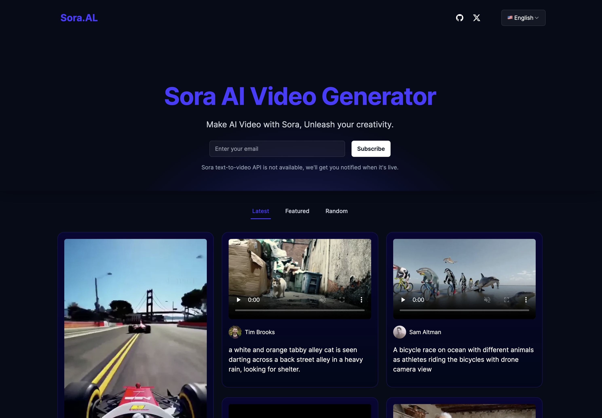

# Sora.AL

Sora AI Video Generator

> Sora text-to-video API is not available. All the videos display on Sora.AL are generated by OpenAI's red team.

[中文说明](./README_CN.md)

## Live Demo

[https://sora.al](https://sora.al)

## Deploy with Vercel

## Credit to

- [aiwallpaper](https://aiwallpaper.shop) for code reference
- [nextjs](https://nextjs.org/docs) for full-stack development
- [appwrite](https://appwrite.io/) for data processing
- [tailwindcss](https://tailwindcss.com/) for page building

## Other Things

you can contact me at Twitter: https://twitter.com/emengweb