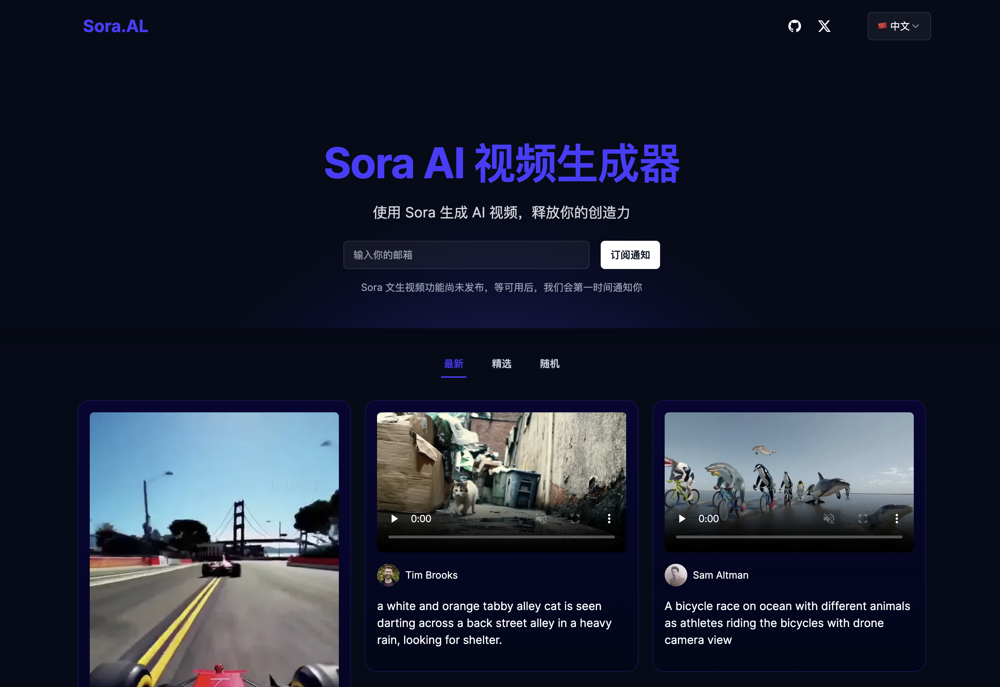

# Sora.AL

Sora AI 视频生成器

> Sora 文本生成视频 API 还未发布，网站上展示的所有视频都是由 OpenAI 官方生成的。

## 线上演示

[https://sora.al](https://sora.al)

## 使用 Vercel 一键部署

## 致谢以下项目

- [aiwallpaper](https://aiwallpaper.shop/) 提供代码参考
- [nextjs](https://nextjs.org/docs) 全栈开发框架
- [laf](https://laf.run/) 后端API接口
- [appwrite](https://appwrite.io/) 数据处理
- [tailwindcss](https://tailwindcss.com/) 页面构建

## 其他

你可以在 Twitter 上联系我: https://twitter.com/emengweb

